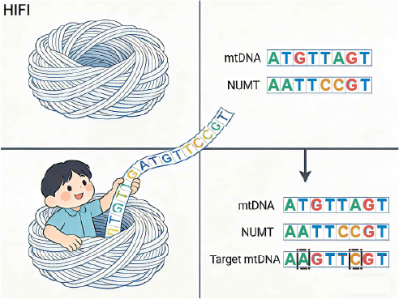

# MitoNumt
Overview

This pipeline provides a practical and reproducible workflow to accurately get true mitochondrial (mtDNA) sequences and all NUMTs from PacBio HiFi sequencing data.

  

requirements

**python3 minimap2 samtools mafft igv**

Mitochondrial reference genome (ref_mt.fa)

Nuclear genome reference (ref_genomic.fna)

HIFI reads (HIFI_subreads.fastq.gz)

**Step 1. Get the true mitochondrial sequence**

1.1 Align the HIFI data to the mitochondrial genome

    minimap2 -t 16 --secondary=no -ax map-hifi ./ref_mt.fa ./HIFI_subreads.fastq.gz | samtools view -@ 16 -b -F4 -F 0x800 -o mt.reads.HiFiMapped.bam
   
    samtools sort -@ 16 -o mt.reads.HiFiMapped.sorted.bam mt.reads.HiFiMapped.bam
   
    samtools index -@ 16 mt.reads.HiFiMapped.sorted.bam

1.2 Reads selection and visualization (optional but recommended)

The sorted BAM file can be visualized in IGV to manually inspect read alignments.

Selection criteria:

Priority is given to HiFi reads spanning the entire MT region, including extended flanks when applicable.

Reads with higher alignment rate and continuity are preferred. such as SRR28532995.4886972, SRR28532995.296568 ...

  

Next, we will compare the selected 3-4 reads with the reference sequence, and then perform visualization and correction in Mega. This will enable us to obtain the True mitochondrial sequence (True_ref_mt.fa).

**Step 2. Identification of candidate NUMT regions in the nuclear genome**

2.1 Candidate NUMT loci are identified by aligning the True_mitochondrial genome to the nuclear genome using minimap2:

    minimap2 -x asm5 ./True_ref_mt.fa ./ref_genomic.fna > *.paf

The resulting PAF file is then inspected to extract nuclear regions showing significant homology to the mitochondrial genome, which are considered putative NUMT loci.

   

2.2 Extraction of reference NUMT regions

*Extension strategy*: recommended for detecting complete or near-complete NUMTs

To get potentially full-length NUMTs, the candidate NUMT region is extended by 2 kb upstream and downstream from the alignment coordinates:
   
	samtools faidx ./ref_genomic.fna CM101310.1:68556902-685561280 > CM101310.1.68556902-68561280.fa

2.2.1 Retrieval of NUMT-associated HiFi reads

    minimap2 -t 16 --secondary=no -ax map-hifi ./CM101310.1.68556902-68561280.fa ./HIFI_subreads.fastq.gz | samtools view -@ 16 -b -F4 -F 0x800 -o numt.reads.HiFiMapped.bam
   
    samtools sort -@ 16 -o numt.reads.HiFiMapped.sorted.bam numt.reads.HiFiMapped.bam
   
    samtools index -@ 16 numt.reads.HiFiMapped.sorted.bam

2.2.2 Read selection and visualization (optional but recommended)

The sorted BAM file can be visualized in IGV to manually inspect read alignments.

Selection criteria:

Priority is given to HiFi reads spanning the entire NUMT region, including extended flanks when applicable.

Reads with higher alignment rate and continuity are preferred.

such as:

   

   
2.2.3 Get NUMT sequence
    
	cat True_ref_mt.fa selected.HIFI.reads.fa > selected.numt-mt.fa

    mafft --auto  selected.numt-mt.fa > selected.numt-mt.mafft.fa  → MEGA

generate the complete.numt.fa

*Non-extension strategy*: recommended for rapid detection of more incomplete NUMTs

2.2.1 For rapid screening of short NUMTs, only the aligned region is extracted without flanking extension:
 
    samtools faidx ./ref_genomic.fna CM101310.1:68558902-68559280 > CM101310.1.68558902-68559280.fa

2.2.2 Retrieval of NUMT-associated HiFi reads

   minimap2 -t 16 --secondary=no -ax map-hifi ./CM101310.1.68558902-68559280.fa ./HIFI_subreads.fastq.gz | samtools view -@ 16 -b -F4 -F 0x800 -o numt.reads.HiFiMapped.bam
   
	 samtools sort -@ 16 -o numt.reads.HiFiMapped.sorted.bam numt.reads.HiFiMapped.bam
   
	 samtools index -@ 16 numt.reads.HiFiMapped.sorted.bam

   

	 python3 ./script/extract_high_identity_reads.py -b reads.HiFiMapped.sorted.bam -o CM101310.1.68558902-68559280 -d pos

   This step generates two FASTA files:

*.numt.high98.full.fa — full-length HIFI reads

*.numt.high98.trim.fa — trimmed high-identity regions

**Step 3. Consensus NUMT sequence reconstruction**

The trimmed NUMT reads are combined with the mitochondrial reference and aligned
The long reads obtained using the extension strategy can also be processed with this script, provided that the portions aligned to the nuclear genome are trimmed.
   
	 cat True_ref_mt.fa CM101310.1.68558902-68559280.numt.high98.trim.fa > CM101310.1.68558902-68559280.numt.high98.trim.mt.fa

     mafft --auto  CM101310.1.68558902-68559280.numt.high98.trim.mt.fa > CM101310.1.68558902-68559280.numt.high98.trim-mt.mafft.fa
   
     python3 ./script/numt_consensus_from_msa.py CM101310.1.68558902-68559280.numt.high98.trim-mt.mafft.fa ref_mt Panthera_pardus.numt

**Final output:**

** *.numt.2597-4082.fa** :2597-4082 is the start-end at True_ref_mt.fa

Perform 4-6 operations on each small segment, and this will result in numerous numt sequences.

 Collect all the information of the numt sequences**

    cat *.numt.* complete.numt.fa > numts.fa

    python ./script/numt_ref_dif.py -n numts.fa -r ../Ture_ref.mt.fa -o prefix

we will get two file  prefix.diff_matrix.tsv  prefix.summary.tsv

Delete the numt sequences with a difference rate less than 0.01 and  fewer than 10 variant sites, and then remove the duplicate numt sequences.
	
**Step 4. Check the NUMT base in MT sequence**

cat all_mt_sequence True_ref.mt.fa complete.numt.fa > prefix.fa

mafft --auto prefix.fa > prefix.mafft.fa

python remove_ref_gap_columns.py prefix.mafft.fa ref_name prefix.mafft.no_gap.fa

python ./script/numt_from_msa.py prefix.mafft.no_gap.fa True_ref.mt True.numt final

we will get three file     
**prefix.numt.filtered.tsv**：The specific locations of NUMT contamination sites in each mitochondrion after filtration.
**prefix.numt.count.tsv**：The statistics of the number of NUMT contamination sites in each mitochondrion after filtration.
**prefix.numt.tsv**: The specific locations of NUMT contamination sites in each mitochondrion

   

